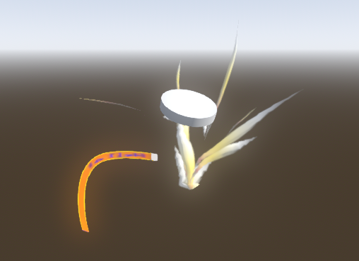
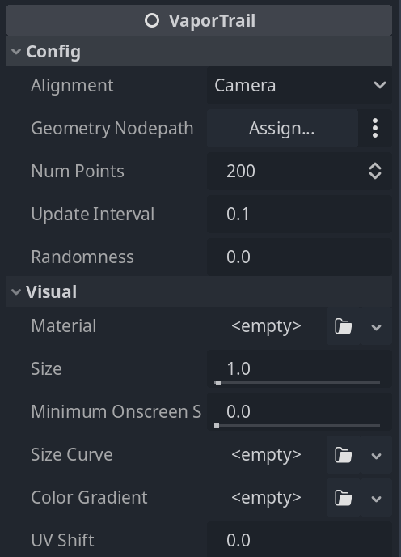

# Vaportrail

<!--toc:start-->

- [Vaportrail](#vaportrail)
  - [About](#about)
    - [Settings](#settings)
      - [Config](#config)
        - [Alignment](#alignment)
        - [Geometry Nodepath](#geometry-nodepath)
        - [Num(ber of) Points](#number-of-points)
        - [Update Interval](#update-interval)
        - [Randomness](#randomness)
      - [Visual](#visual)
        - [Material](#material)
        - [size](#size)
        - [Minimum Onscreen Size](#minimum-onscreen-size)
        - [Size Curve](#size-curve)
        - [Color Gradient](#color-gradient)
        - [UV Shift](#uv-shift)
<!--toc:end-->
Godot 4.x vapor trails and ribbon effects.

## About

This is a new and improved version of [godot_trailmesh](https://github.com/tcmug/godot_trailmesh).

Still a bit of work to do.

### Settings

#### Config

##### Alignment

Defines how to align/orient the mesh:

- Camera: Facing camera
- X: Along the X axis
- Y: Along the Y axis
- Z: Along the Z axis

##### Geometry Nodepath

In some situations where the active camera cannot be fetched, e.g. when using viewports, this will force
the mesh instance to be placed under the given node instead of directly under the VaporTrail node.

Also, if you wish to prevent the trail from disappearing when the VaporTrail node is removed, setting this
allows the trail to fade out instead of abruptly disappear. This is not perfect but works for some situations.

##### Num(ber of) Points

How many points, or how detailed the mesh can be - essentially defines how long it is along with Update Interval.

##### Update Interval

When the VaporTrail mesh is moving, how often we push a new point to the mesh (or how often it is allowed to grow). The smaller this is the smoother the trail will be, but for now this is also tied to frame rate.

##### Randomness

Adds a bit of randomness to the point size.

#### Visual

##### Material

The material applied to the mesh. NOTE: as the mesh itself is already "billboarded" billboarding via material will break things.

##### Size

Size of the points, 1 gives a ribbon of 1 unit width.

##### Minimum Onscreen Size

Correctly applies to only trails with Camera alignment. This ensures the mesh will not be smaller than the given amount of pixels when rendered. Useful for making very distant trails visible.

##### Size Curve

Gives a little bit of shape for the trail, adjusting the point size. This will affect Minimum Onscreen Size.

##### Color Gradient

Gives color to your trail.

##### UV Shift

Applies simple animation by shofting the positioning of the texture in the uv x axis.
